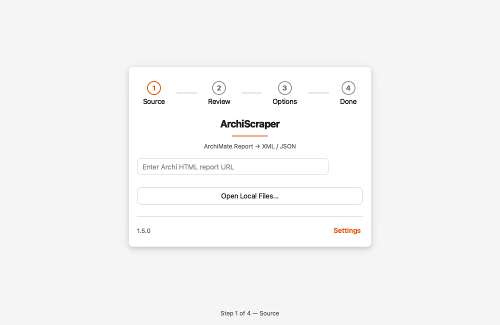
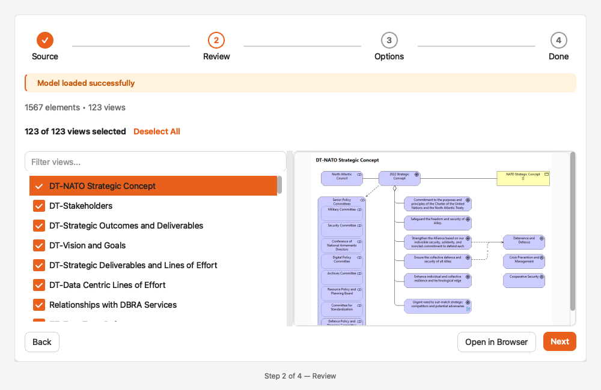
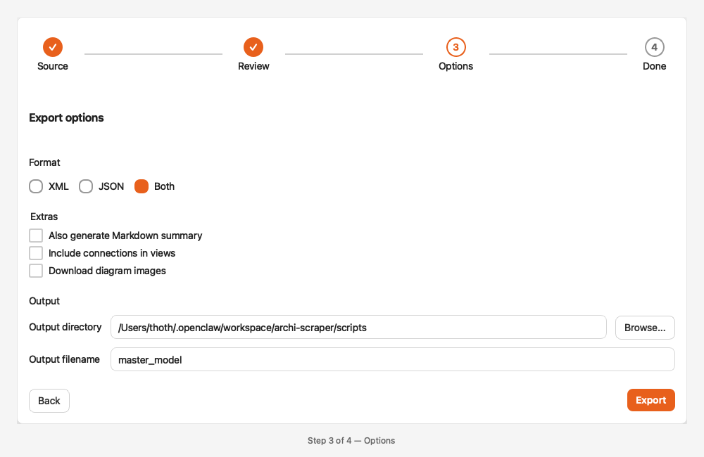
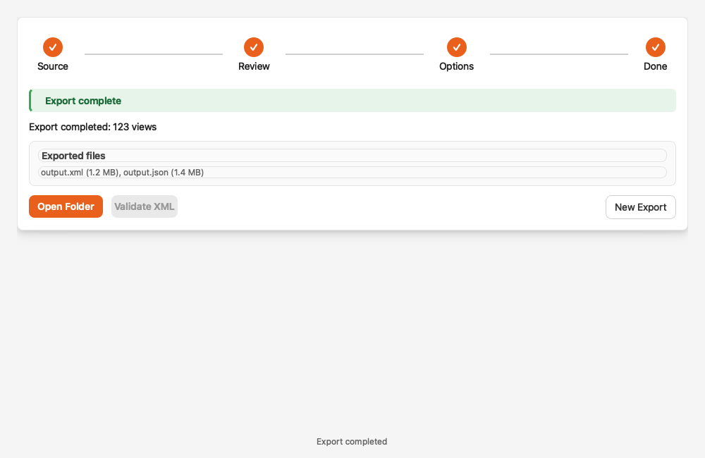

# Archi Scraper

### An ArchiMate Web Report to XML Converter

[](https://github.com/gonzalopezgil/archi-scraper/releases)
[](https://github.com/gonzalopezgil/archi-scraper/releases)
[](https://github.com/gonzalopezgil/archi-scraper)
[](https://github.com/gonzalopezgil/archi-scraper)
[](https://github.com/gonzalopezgil/archi-scraper)

**Reverse-engineer Archi HTML reports back into editable ArchiMate models**

ArchiScraper extracts architecture data from published Archi HTML reports and converts them back into standard ArchiMate Open Exchange Format (`.xml`), JSON, or Markdown. Recover lost models, extract data from shared reports, or migrate content between tools.

## GUI Preview

### Step 1 — Source


### Step 2 — Review


### Step 3 — Export Options


### Step 4 — Done


---

## Key Features

- **GUI application** with embedded browser, network sniffer, and batch export
- **CLI tool** for scripting and automation with full flag support
- **Three output formats**: XML (ArchiMate OEF), JSON, and Markdown
- **Clean Views**: connections hidden by default to avoid spiderweb clutter
- **Retry with backoff**: automatic retry on server errors (5xx, 429, connection issues)
- **XML validation**: checks ID uniqueness and reference integrity
- **Local + remote**: works with live URLs or local HTML files
- **Batch mode**: collect multiple views into a single master model
- **View images**: download PNG images for each view
- **Network sniffer**: auto-discovers `model.html` GUID from browser traffic
- **Shared core**: GUI and CLI use the same parser/generator (no code duplication)

---

## Installation

### Option A: From source (recommended)

```bash
# Install directly from GitHub
pip install "git+https://github.com/gonzalopezgil/archi-scraper.git"

# Or clone for development
git clone https://github.com/gonzalopezgil/archi-scraper.git
cd archi-scraper
python3 -m venv .venv && source .venv/bin/activate
pip install -e ".[dev]"    # Core + pytest
pip install -e ".[gui]"    # Add GUI support (PyQt6)
```

### Option B: Portable executables

Download from [Releases](https://github.com/gonzalopezgil/archi-scraper/releases):
- **Windows**: `ArchiScraper_v1.0_Windows.zip` — unzip and run `ArchiScraper.exe`
- **macOS (Apple Silicon)**: `ArchiScraper_v1.0_macOS_Silicon.zip` — right-click → Open on first run

---

## CLI Usage

### Remote URL mode

```bash
# List all views
python3 scripts/html_to_archimate_xml.py --url URL --list-views

# Download all views as master XML
python3 scripts/html_to_archimate_xml.py --url URL --download-all -o master.xml

# Download with images, connections, markdown, and validation
python3 scripts/html_to_archimate_xml.py --url URL --download-all \
  --connections --images --markdown --validate -o master.xml

# Export as JSON instead of XML
python3 scripts/html_to_archimate_xml.py --url URL --download-all --format json -o master.json

# Select specific views only
python3 scripts/html_to_archimate_xml.py --url URL --select-views id-abc123 id-def456 -o selected.xml
```

### Local file mode

```bash
python3 scripts/html_to_archimate_xml.py --model model.html --views view1.html view2.html -o output.xml
```

### All CLI flags

| Flag | Description | Default |
|---|---|---|
| `--url URL` | Remote Archi HTML report URL | — |
| `--model FILE` | Local model.html path | — |
| `--views FILE...` | Local view HTML files | — |
| `--download-all` | Download all views from remote model | off |
| `--list-views` | List all views without downloading | off |
| `--select-views ID...` | Download specific view IDs | — |
| `--output, -o FILE` | Output filename | `master_model.xml` |
| `--format FORMAT` | Output format: `xml`, `json`, or `both` | `xml` |
| `--connections` | Include connection elements in views | off |
| `--images` | Download PNG images per view (URL mode) | off |
| `--images-dir DIR` | Image output directory | `images/` |
| `--markdown` | Generate .md alongside output | off |
| `--validate` | Validate XML and print warnings | off |
| `--user-agent STR` | Custom User-Agent header | random |
| `--timeout SECS` | HTTP timeout in seconds | `30` |

### XML-to-Markdown converter

```bash
python3 scripts/archiscraper_to_markdown.py --input master.xml --output-dir docs/
```

Generates structured documentation organized by ArchiMate layer:
- `README.md` — overview
- `elements/` — strategy, business, application, technology, motivation, implementation
- `relationships.md` — full relationship table with directional arrows (`→` / `←`)
- `views/index.md` — all views with elements

---

## GUI Application

```bash
python3 scripts/ArchiScraperApp.py
```

The GUI provides all CLI features plus:

| Feature | Description |
|---|---|
| **Embedded browser** | Navigate Archi HTML reports directly |
| **Network sniffer** | Auto-captures `model.html` URL from browser traffic |
| **Batch mode** | Add/remove views, export all as master model |
| **Download ALL Views** | One-click download with progress bar |
| **Local file mode** | Load model + view HTML files from disk |
| **List / Select Views** | Dialog-based view selection |
| **Export as JSON** | Alongside or instead of XML |
| **Convert XML → Markdown** | Built-in markdown conversion |
| **Validate XML** | Check ID uniqueness and reference integrity |
| **User-Agent / Timeout** | Configurable per session |
| **Image download** | Separate toggles for single and batch export |

---

## Architecture

```text
ArchiScraperApp.py (GUI)
        |\
        | \
        |  v
        |  archiscraper_core.py
        |  (ModelDataParser, ViewParser, ArchiMateXMLGenerator)
        |  - fetch_with_retry (exponential backoff)
        |  - validate_xml (reference integrity)
        |  - export_json (XML → dict)
        |
        v
html_to_archimate_xml.py (CLI) ----> archiscraper_to_markdown.py (Docs)
```

---

## Development

```bash
pip install -e ".[dev]"
pytest -v                  # 57 tests
```

### Running tests

```bash
python3 -m pytest tests/ -v
```

Tests cover: core parser, XML generation, relationship extraction, type mapping, URL handling, retry logic, validation, CLI argument parsing, and markdown conversion.

---

## Notes / Limitations

- Only works with **Archi HTML Report** exports (standard format)
- Remote URL mode requires network access to the report
- Connection bendpoints are not preserved (connections use straight lines)
- View images are only available in URL mode (`--images`)
- Some complex nested relationships may need manual adjustment after import

---

## Roadmap

- [x] GUI + CLI feature parity
- [x] XML, JSON, and Markdown output formats
- [x] Retry with exponential backoff
- [x] XML validation
- [x] 57 unit tests
- [ ] GitHub Actions CI
- [ ] PyPI package
- [ ] Progress callbacks for CLI (verbose mode)

---

## License

GNU General Public License v3.0 — see [LICENSE](LICENSE).

---

## Contributing

Contributions welcome! Please submit issues or pull requests.
